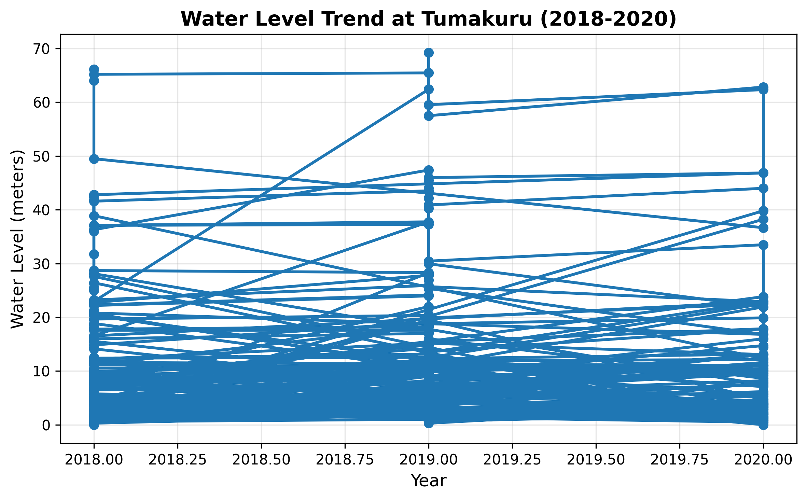

# Jal Drishti AI — Groundwater Analysis Chatbot

An AI-powered chatbot that answers natural-language questions about groundwater levels across India using Central Ground Water Board (CGWB) data (2018–2020).

Built for the **Ingres Fintech Hackathon**.

---

## Quick Start

### Prerequisites
- Node.js 16+
- Python 3.8+

### One-command setup
```bash
npm run dev
```
This installs dependencies and starts both servers.

### Manual setup
```bash
# Install everything
npm install
pip install -r backend/requirements.txt

# Start both servers
npm run dev
```

### Access
| Service   | URL                     |
|-----------|-------------------------|
| Frontend  | http://localhost:8080   |
| Backend   | http://localhost:5000   |

---

## Data

- **Source**: Central Ground Water Board (CGWB)
- **Period**: 2018–2020
- **Format**: JSON (`backend/ingres_clone.json` — you must provide this file)
- **Locations**: Groundwater monitoring stations across Indian districts

The dataset is historical and static. Predictions are extrapolative trend estimates, not forecasts.

---

## Features

### Core
- Natural-language query parsing (location extraction, year/range detection)
- Groundwater level lookup by location and year
- Multi-year trend analysis with chart generation (matplotlib)
- TF-IDF + cosine similarity location matching (difflib)

### AI (requires OpenAI API key)
- GPT-3.5-turbo response generation (default when key is set)
- Context-aware explanations and insights
- Graceful fallback to TF-IDF when no API key is configured

### Frontend
- Chat interface with message history
- Suggestion chips for common queries
- Voice input via Web Speech API (Chrome/Edge)
- Trend chart display inline

---

## Project Structure

```
├── frontend/                # Vite + vanilla JS chat UI
│   ├── index.html
│   ├── src/main.js
│   ├── src/styles.css
│   └── package.json
├── backend/                 # Flask API server
│   ├── app.py               # Main application
│   ├── requirements.txt     # Python dependencies
│   └── .env.example         # Environment template
├── ChatbotIngres.ipynb      # Original notebook (prototype)
├── setup_ai_chatbot.py      # Automated setup script
├── start.bat / start.sh     # Platform startup scripts
├── package.json             # Root orchestration (npm)
└── README.md
```

---

## Configuration

Create `backend/.env`:

```env
OPENAI_API_KEY=sk-...   # Required for GPT-3.5 responses
DEFAULT_LANGUAGE=EN     # EN, HI, BN, TE, TA, GU
```

Without an API key, the backend uses TF-IDF matching for location lookup and returns template-based responses.

---

## API

### `POST /api/chat`

```json
{
  "query": "What is the water level in Mumbai in 2020?",
  "language": "EN"
}
```

```json
{
  "answer": "Water level data for Mumbai in 2020...",
  "chart_url": "/api/charts/trend.png",
  "ai_insights": true,
  "language": "EN",
  "suggestions": ["..."]
}
```

### `GET /api/health`

```json
{ "status": "ok", "openai": true, "data_loaded": true }
```

---

## Demo

> *Live GIF coming soon. For now, the screenshot below shows the Tumakuru trend chart generated by the system.*



---

## License

MIT
